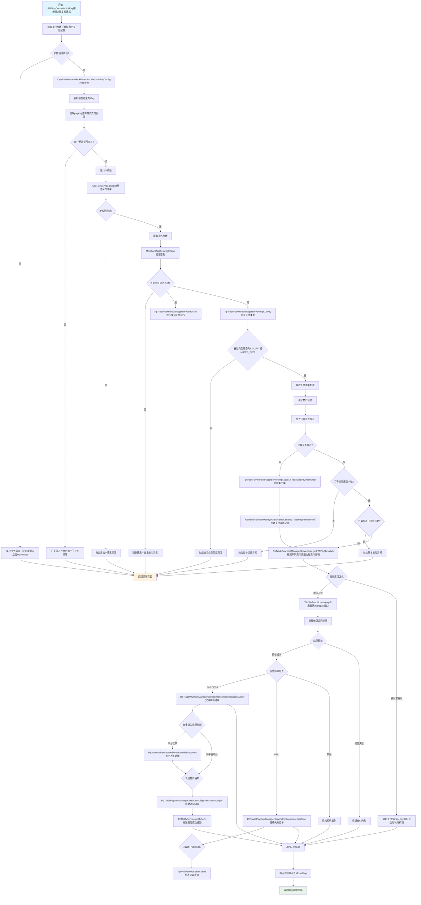

# L3-F2FPayController.initPay

## 一、业务概述
面对面支付（条码支付）处理流程，验证支付参数、商户配置、IP白名单和签名，执行微信/支付宝支付，处理支付结果并完成订单状态更新和商户通知。

## 二、活动列表
| ID | 名称 | 描述 |
|---|------|------|
| L4-003 | F2FPayController.initPay | 处理面对面支付（条码支付）的初始化请求，验证支付参数并执行支付操作 |
| L4-014 | RpTradePaymentManagerService.f2fPay | 面对面支付处理方法，用于处理用户通过扫码等方式进行的面对面支付交易 |
| L4-028 | CnpPayService.checkParamAndGetUserPayConfig | 支付服务参数校验并获取用户支付配置信息的方法，负责校验请求参数的完整性、验证商户合法性、进行IP地址校验和签名验证 |
| L4-038 | RpTradePaymentManagerServiceImpl.f2fPay | 面对面支付处理方法，用于处理扫码支付或刷卡支付等面对面支付场景的业务逻辑 |
| L4-026 | MerchantApiUtil.isRightSign | 方法 com.roncoo.pay.utils.MerchantApiUtil#isRightSign |
| L4-041 | CnpPayService.getErrorResponse | 根据绑定结果获取错误响应信息，将所有验证错误消息拼接成逗号分隔的字符串返回 |
| L4-007 | RpUserPayConfigService.getByPayKey | 方法 com.roncoo.pay.user.service.RpUserPayConfigService#getByPayKey |
| L4-042 | CnpPayService.checkIp | 支付服务IP地址安全校验方法，用于验证请求来源IP是否在商户服务器IP白名单中，确保支付请求的安全性 |
| L4-029 | RpTradePaymentManagerServiceImpl.getF2FPayResultVo | 获取面对面支付结果对象，处理微信和支付宝的扫码支付业务逻辑，包括支付请求发送、结果处理和签名验证 |
| L4-021 | RpPayWayService.getByPayWayTypeCode | 方法 com.roncoo.pay.user.service.RpPayWayService#getByPayWayTypeCode |
| L4-011 | RpUserInfoService.getDataByMerchentNo | 方法 com.roncoo.pay.user.service.RpUserInfoService#getDataByMerchentNo |
| L4-030 | RpTradePaymentOrderDao.selectByMerchantNoAndMerchantOrderNo | 根据商户编号和商户订单号查询交易支付订单信息 |
| L4-005 | RpTradePaymentManagerServiceImpl.sealF2FRpTradePaymentOrder | 构建F2F（面对面）支付交易订单实体，将支付请求数据、用户信息和支付方式等组装成完整的交易支付订单对象 |
| L4-044 | MerchantApiUtil.getSign | 方法 com.roncoo.pay.utils.MerchantApiUtil#getSign |
| L4-013 | RpUserPayConfigServiceImpl.getByPayKey | 方法 com.roncoo.pay.user.service.impl.RpUserPayConfigServiceImpl#getByPayKey |
| L4-002 | StringUtil.isEmpty | 方法 com.roncoo.pay.common.core.utils.StringUtil#isEmpty |
| L4-023 | NetworkUtil.getIpAddress | 方法 com.roncoo.pay.utils.NetworkUtil#getIpAddress |
| L4-035 | RpTradePaymentManagerServiceImpl.sealRpTradePaymentRecord | 构建和封装交易支付记录实体对象，用于创建支付订单并初始化相关交易信息 |
| L4-018 | RpUserPayInfoService.getByUserNo | 方法 com.roncoo.pay.user.service.RpUserPayInfoService#getByUserNo |
| L4-024 | WeiXinPayUtil.micropay | 方法 com.roncoo.pay.trade.utils.weixin.WeiXinPayUtil#micropay |
| L4-037 | RpNotifyService.orderSend | 根据银行订单号触发订单通知发送，用于向相关系统或服务推送订单状态变更信息 |
| L4-046 | RpTradePaymentManagerServiceImpl.completeSuccessOrder | 完成支付成功的订单处理，更新交易记录和订单状态，并根据资金流入类型进行账户入账处理，最后向商户发送支付成功通知 |
| L4-025 | RpTradePaymentManagerServiceImpl.completeFailOrder | 完成失败订单处理，更新支付记录和订单状态为失败，并发送商户通知 |
| L4-012 | RpPayWayServiceImpl.getByPayWayTypeCode | 根据支付产品编码、支付方式编码和支付类型编码查询有效的支付方式信息 |
| L4-020 | RpUserInfoServiceImpl.getDataByMerchentNo | 根据商户编号获取用户信息数据 |
| L4-027 | RpTradePaymentOrderDaoImpl.selectByMerchantNoAndMerchantOrderNo | 根据商户编号和商户订单号查询交易支付订单信息 |
| L4-043 | DateUtils.parseDate | 方法 com.roncoo.pay.common.core.utils.DateUtils#parseDate |
| L4-017 | MD5Util.encode | 方法 com.roncoo.pay.utils.MD5Util#encode |
| L4-010 | WeixinConfigUtil.readConfig | 方法 com.roncoo.pay.trade.utils.WeixinConfigUtil#readConfig |
| L4-033 | BuildNoService.buildTrxNo | 构建交易流水号的方法，用于生成唯一的交易编号 |
| L4-009 | BuildNoService.buildBankOrderNo | 构建银行订单号的方法，用于生成唯一的银行交易订单编号 |
| L4-006 | RpUserPayInfoServiceImpl.getByUserNo | 方法 com.roncoo.pay.user.service.impl.RpUserPayInfoServiceImpl#getByUserNo |
| L4-039 | WeiXinPayUtil.getSign | 方法 com.roncoo.pay.trade.utils.weixin.WeiXinPayUtil#getSign |
| L4-022 | WeiXinPayUtil.getnonceStr | 方法 com.roncoo.pay.trade.utils.weixin.WeiXinPayUtil#getnonceStr |
| L4-040 | WeiXinPayUtil.mapToXml | 方法 com.roncoo.pay.trade.utils.weixin.WeiXinPayUtil#mapToXml |
| L4-019 | WeiXinPayUtils.httpXmlRequest | 方法 com.roncoo.pay.trade.utils.WeiXinPayUtils#httpXmlRequest |
| L4-031 | RpNotifyServiceImpl.orderSend | 通过消息队列发送订单通知，将银行订单号作为消息内容推送到订单通知队列中 |
| L4-004 | RpNotifyService.notifySend | 向指定的商户通知URL发送异步通知消息，用于支付系统中订单状态变更后的回调通知 |
| L4-032 | RpAccountTransactionService.creditToAccount | 向指定用户账户进行贷方入账操作，将指定金额增加到用户账户余额中，并记录相应的交易流水 |
| L4-001 | RpTradePaymentManagerServiceImpl.getMerchantNotifyUrl | 根据支付记录、支付订单和交易状态等信息构建商户通知URL，用于向商户系统发送支付结果通知 |
| L4-036 | BaseDaoImpl.getBy | 方法 com.roncoo.pay.common.core.dao.impl.BaseDaoImpl#getBy |
| L4-045 | MD5Util.byteArrayToHexString | 方法 com.roncoo.pay.utils.MD5Util#byteArrayToHexString |
| L4-034 | DateUtils.formatDate | 方法 com.roncoo.pay.common.core.utils.DateUtils#formatDate |
| L4-008 | MerchantApiUtil.getParamStr | 方法 com.roncoo.pay.utils.MerchantApiUtil#getParamStr |
| L4-015 | MD5Util.byteToHexChar | 方法 com.roncoo.pay.utils.MD5Util#byteToHexChar |

## 三、业务流程图

## 四、业务规则汇总

### 4.1 验证规则
- L5-018: 订单号格式需要符合银行系统规范
- L5-061: 必须提供有效的银行订单号作为输入参数
- L5-064: 仅支持F2F_PAY和MICRO_PAY两种支付类型
- L5-035: payKey对应的商户支付配置必须存在，否则交易无效
- L5-031: 商户编号不能为空
- L5-020: 通过支付产品编码、支付方式编码、支付类型编码三个维度进行精确匹配
- L5-054: 交易流水号必须是唯一的，不能重复
- L5-041: 微信支付需要进行验签验证返回结果的真实性
- L5-017: 生成的订单号必须是唯一的
- L5-066: 订单号不能重复，若订单已存在需验证金额一致性和支付状态
- L5-002: 通知URL必须包含所有必要的支付参数以供商户验证
- L5-021: 必须同时满足三个编码条件才能返回对应的支付方式信息
- L5-006: 支付操作需要使用验证后的支付配置和请求参数
- L5-065: 必须验证用户支付配置的有效性
- L5-045: 商户订单号不能为空
- L5-022: 必须提供有效的用户支付配置信息
- L5-033: 必须存在对应的交易支付订单记录才能查询成功
- L5-024: 需要验证支付金额的合法性
- L5-004: 参数中必须包含交易状态信息以便商户处理不同状态的订单
- L5-009: 必须提供有效的通知URL地址才能发送通知
- L5-005: 必须先通过参数验证才能获取用户支付配置
- L5-077: 支付成功时必须更新交易记录的支付时间、银行流水号、银行返回消息和状态
- L5-069: 需要处理BindingResult中的所有验证错误
- L5-050: 入账金额必须为正数且不能为零
- L5-047: 必须配置正确的消息队列名称MqConfig.ORDER_NOTIFY_QUEUE
- L5-051: 目标账户必须存在且处于可用状态
- L5-038: 所有校验步骤都必须通过才能返回有效的支付配置信息
- L5-023: 支付请求参数必须完整且符合业务规范
- L5-040: 必须验证商户支付配置信息的有效性
- L5-046: 必须存在对应的交易支付订单记录
- L5-034: 必须先通过参数完整性校验才能继续处理
- L5-044: 商户编号不能为空
- L5-032: 商户订单号不能为空
- L5-026: 用户必须处于激活状态才能被查询到
- L5-081: 交易记录和交易订单的状态必须保持一致

### 4.2 安全规则
- L5-036: 请求IP必须在商户配置的IP白名单内
- L5-075: IP校验失败时抛出非法IP请求异常
- L5-043: 返回结果必须包含签名验证以确保数据完整性
- L5-072: 只有安全等级为MD5_IP模式时才执行IP校验
- L5-003: 通知URL需要进行数字签名以确保数据完整性和安全性
- L5-074: 请求IP必须存在于商户服务器IP白名单中
- L5-073: 请求IP不能为空，否则视为参数错误
- L5-037: 请求参数中的签名必须与商户密钥计算得出的签名一致
- L5-076: IP获取过程中发生IO异常时转换为业务异常

### 4.3 业务规则
- L5-049: 采用异步方式发送消息，不阻塞当前线程
- L5-057: 订单状态初始化为等待支付(WAITING_PAYMENT)
- L5-029: 需要保存银行返回的失败信息到支付记录中
- L5-048: 消息以文本格式传输银行订单号
- L5-053: 入账操作需要保证数据一致性和事务完整性
- L5-080: 所有成功的支付都需要向商户发送支付成功通知
- L5-039: 支持微信刷卡支付(MICRO_PAY)和支付宝当面付(F2F_PAY)两种模式
- L5-016: 下单日期和时间需要进行格式转换解析
- L5-052: 同一请求号不能重复处理避免重复入账
- L5-070: 错误消息之间使用逗号分隔
- L5-012: 订单状态初始化为等待支付(WAITING_PAYMENT)
- L5-014: 资金流入方向来源于用户支付配置
- L5-025: 需确保支付渠道可用性
- L5-008: 发生业务异常或系统异常时统一跳转到异常页面显示错误信息
- L5-071: 最终结果要去除末尾多余的逗号
- L5-019: 只查询状态为激活(Active)的支付方式
- L5-058: 当资金流入方向为平台收款时，需要根据费率计算平台收入、成本和利润
- L5-067: 已支付成功的订单不允许重复支付
- L5-007: 成功支付后需要跳转到支付确认页面供用户确认
- L5-056: 