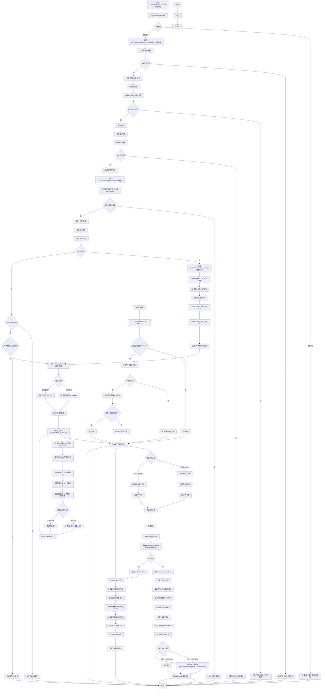

# L3-F2FPayController.initPay

## 一、业务概述
处理面对面支付初始化请求，验证支付参数并执行支付操作，支持微信和支付宝两种支付方式，包含参数验证、签名验证、IP校验、订单处理、支付执行和结果通知等完整流程。

## 二、活动列表
| ID | 名称 | 描述 |
|---|------|------|
| L4-501 | F2FPayController.initPay | 处理面对面支付初始化请求，验证支付参数并执行支付操作 |

## 三、业务流程图

## 四、业务规则汇总

### 4.1 验证规则
- L5-006: 支付参数必须完整且符合验证规则
- L5-010: 参数校验失败时需要返回具体的错误信息
- L5-013: 返回所有验证失败的错误信息汇总
- L5-031: 需要校验支付请求参数的完整性
- L5-033: 必须同时提供有效的商户编号和商户订单号才能进行查询
- L5-036: 商户订单号和商户号必须匹配已存在的支付记录
- L5-037: 查询时必须同时匹配支付产品编码、支付方式编码和支付类型编码三个条件
- L5-041: 商户订单号不能为空
- L5-042: 必须存在对应的交易支付订单记录
- L5-044: 必须验证商户支付配置的有效性
- L5-045: 订单号必须唯一，相同订单号需验证金额一致性
- L5-046: 已支付成功的订单不能重复支付
- L5-047: 需要根据商户号和订单号查询并验证订单状态
- L5-049: 必须能够成功获取到请求的客户端IP地址
- L5-052: 必须提供有效的银行订单号才能触发通知发送
- L5-059: 商户必须配置正确的支付信息才能完成支付
- L5-060: 必须存在有效的用户支付配置，否则抛出异常
- L5-061: 参数映射表必须包含支付KEY、商品名称、订单编号、订单金额等核心信息
- L5-064: 入账金额必须大于零
- L5-065: 用户编号必须存在且有效
- L5-068: 必须先通过参数验证才能获取支付配置
- L5-071: 交易流水号必须保证全局唯一性
- L5-073: 支付记录和对应的支付订单都必须更新为失败状态
- L5-074: 必须保存银行返回的失败信息到支付记录中
- L5-040: 商户编号不能为空
- L5-007: 支付密钥对应的商户必须在系统中存在
- L5-009: 请求参数的签名必须与商户密钥匹配

### 4.2 安全规则
- L5-008: 请求IP必须在商户配置的允许访问列表中
- L5-048: 只有当安全等级为MD5_IP时才执行IP校验
- L5-051: IP不在白名单中的请求会被拒绝并返回非法IP错误
- L5-058: 返回结果需要进行签名验证以确保数据安全
- L5-062: 最终URL必须包含签名验证以确保数据安全性
- L5-050: 请求IP必须存在于商户配置的服务器IP白名单中

### 4.3 业务规则
- L5-001: 只查询状态为激活的用户信息
- L5-002: 使用商户编号作为用户编号进行查询
- L5-003: 必须配置正确的消息队列名称MqConfig.ORDER_NOTIFY_QUEUE
- L5-004: 消息以文本格式传输订单号信息
- L5-005: 采用异步方式发送通知消息
- L5-011: 错误消息之间用逗号分隔
- L5-012: 需要移除末尾多余的逗号
- L5-014: 订单状态初始化为等待支付状态
- L5-015: 订单过期时间设置为当前时间
- L5-016: 需要从字符串格式解析订单日期和时间
- L5-017: 必须包含完整的商品、商户、支付方式等基础信息
- L5-018: 银行订单号必须保证全局唯一性
- L5-019: 订单号应遵循银行系统的编号规范
- L5-020: 每次调用都应生成新的不重复的订单号
- L5-021: 只有当资金流入类型为平台收款时才执行账户入账操作
- L5-022: 需要同时更新交易记录表和支付订单表的状态为成功
- L5-023: 无论支付类型如何都需要向商户发送支付成功通知
- L5-024: 账户入账时需要扣除平台收入部分，只入账净额
- L5-025: 当资金流入方向为平台收款时，需要计算平台收入(订单金额*费率/100)、平台成本(订单金额*微信费率/100)和平台利润(收入-成本)
- L5-026: 交易状态初始设置为等待支付状态
- L5-027: 交易类型固定设置为支出类型(EXPENSE)
- L5-028: 订单来源固定设置为用户支出(USER_EXPENSE)
- L5-029: 支付流水号和银行订单号通过编号服务自动生成
- L5-030: 需要验证支付配置的有效性
- L5-032: 支持主流面对面支付方式如支付宝、微信扫码支付
- L5-034: 查询结果唯一，根据商户编号和订单号组合确定唯一的交易支付订单
- L5-035: 必须提供有效的通知URL才能发送通知
- L5-038: 只返回状态为激活(Active)的支付方式配置
- L5-039: 该方法是接口的实现方法，提供统一的查询入口
- L5-043: 仅支持F2F_PAY和MICRO_PAY两种支付类型
- L5-053: 通知发送失败时应有相应的重试机制
- L5-054: 需要确保通知消息的准确性和完整性
- L5-055: 支持微信和支付宝两种面对面支付方式
- L5-056: 微信支付使用micropay接口，支付宝使用tradePay接口
- L5-057: 支付结果通过异步通知轮询机制确认最终状态
- L5-066: 同一请求流水号不能重复入账
- L5-067: 入账操作需要保持数据一致性
- L5-069: 支付执行失败时需要记录详细错误信息
- L5-070: 系统异常和业务异常需要分别处理并返回相应错误页面
- L5-072: 交易流水号应具备可识别的格式规范
- L5-075: 需要向商户发送失败通知
- L5-063: 日期时间需要按照特定格式进行格式化

## 五、关联实体

### 5.1 实体列表
| ID | 名称 | 类型 |
|---|------|------|
| L6-013 | RpAccount | Entity |
| L6-025 | RpUserInfo | Entity |
| L6-020 | RpUserPayConfig | Entity |
| L6-026 | Object | Entity |
| L6-006 | RpTradePaymentRecord | Entity |
| L6-009 | F2FPayRequestBo | BO |
| L6-015 | PayTypeEnum | Entity |
| L6-014 | F2FPayResultVo | VO |
| L6-024 | ModelMap | Entity |
| L6-007 | RpTradePaymentOrder | Entity |
| L6-010 | List | Entity |
| L6-004 | Date | Entity |
| L6-001 | RpPayWay | Entity |
| L6-019 | TradeStatusEnum | Entity |

## 六、总结
该业务流程是面对面支付系统的核心功能模块，提供了完整的支付处理能力，包括参数验证、安全校验、订单管理、支付执行和结果通知等关键环节。支持微信和支付宝两大主流支付渠道，具备完善的风控机制和异常处理能力，确保支付过程的安全性和可靠性。通过标准化的接口设计和灵活的配置管理，为商户提供了便捷的支付接入服务，具有重要的商业价值和技术意义。