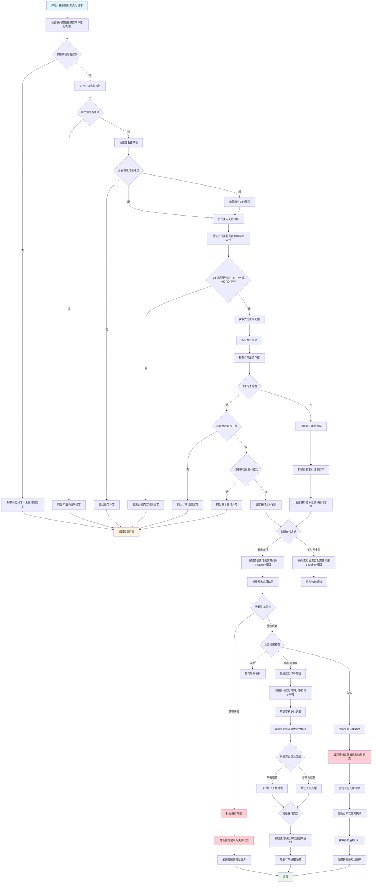

# L3-F2FPayController.initPay

## 一、业务概述
处理面对面支付（条码支付）的初始化请求，验证支付参数并执行支付操作，支持微信刷卡支付和支付宝当面付两种模式，确保支付安全性和交易完整性。

## 二、活动列表
| ID | 名称 | 描述 |
|---|---|---|
| L4-015 | F2FPayController.initPay | 处理面对面支付（条码支付）的初始化请求，验证支付参数并执行支付操作 |
| L4-038 | RpTradePaymentManagerService.f2fPay | 面对面支付处理方法，用于处理用户通过扫码等方式进行的面对面支付交易 |
| L4-018 | CnpPayService.checkParamAndGetUserPayConfig | 支付服务参数校验并获取用户支付配置信息的方法，负责校验请求参数的完整性、验证商户合法性、进行IP地址校验和签名验证 |
| L4-001 | RpTradePaymentManagerServiceImpl.f2fPay | 面对面支付处理方法，用于处理扫码支付或刷卡支付等面对面支付场景的业务逻辑 |
| L4-030 | MerchantApiUtil.isRightSign | 方法 com.roncoo.pay.utils.MerchantApiUtil#isRightSign |
| L4-012 | CnpPayService.getErrorResponse | 根据绑定结果获取错误响应信息，将所有验证错误消息拼接成逗号分隔的字符串返回 |
| L4-034 | RpUserPayConfigService.getByPayKey | 方法 com.roncoo.pay.user.service.RpUserPayConfigService#getByPayKey |
| L4-037 | CnpPayService.checkIp | 支付服务IP地址安全校验方法，用于验证请求来源IP是否在商户服务器IP白名单中，确保支付请求的安全性 |
| L4-017 | RpTradePaymentManagerServiceImpl.getF2FPayResultVo | 获取面对面支付结果对象，处理微信和支付宝的扫码支付业务逻辑，包括支付请求发送、结果处理和签名验证 |
| L4-016 | RpPayWayService.getByPayWayTypeCode | 方法 com.roncoo.pay.user.service.RpPayWayService#getByPayWayTypeCode |
| L4-029 | RpUserInfoService.getDataByMerchentNo | 方法 com.roncoo.pay.user.service.RpUserInfoService#getDataByMerchentNo |
| L4-031 | RpTradePaymentOrderDao.selectByMerchantNoAndMerchantOrderNo | 根据商户编号和商户订单号查询交易支付订单信息 |
| L4-041 | RpTradePaymentManagerServiceImpl.sealF2FRpTradePaymentOrder | 构建F2F（面对面）支付交易订单实体，将支付请求数据、用户信息和支付方式等组装成完整的交易支付订单对象 |
| L4-008 | MerchantApiUtil.getSign | 方法 com.roncoo.pay.utils.MerchantApiUtil#getSign |
| L4-011 | RpUserPayConfigServiceImpl.getByPayKey | 方法 com.roncoo.pay.user.service.impl.RpUserPayConfigServiceImpl#getByPayKey |
| L4-046 | StringUtil.isEmpty | 方法 com.roncoo.pay.common.core.utils.StringUtil#isEmpty |
| L4-022 | NetworkUtil.getIpAddress | 方法 com.roncoo.pay.utils.NetworkUtil#getIpAddress |
| L4-035 | RpTradePaymentManagerServiceImpl.sealRpTradePaymentRecord | 构建和封装交易支付记录实体对象，用于创建支付订单并初始化相关交易信息 |
| L4-040 | RpUserPayInfoService.getByUserNo | 方法 com.roncoo.pay.user.service.RpUserPayInfoService#getByUserNo |
| L4-027 | WeiXinPayUtil.micropay | 方法 com.roncoo.pay.trade.utils.weixin.WeiXinPayUtil#micropay |
| L4-009 | RpNotifyService.orderSend | 根据银行订单号触发订单通知发送，用于向相关系统或服务推送订单状态变更信息 |
| L4-036 | RpTradePaymentManagerServiceImpl.completeSuccessOrder | 完成支付成功的订单处理，更新交易记录和订单状态，并根据资金流入类型进行账户入账处理，最后向商户发送支付成功通知 |
| L4-005 | RpTradePaymentManagerServiceImpl.completeFailOrder | 完成失败订单处理，更新支付记录和订单状态为失败，并发送商户通知 |
| L4-021 | RpPayWayServiceImpl.getByPayWayTypeCode | 根据支付产品编码、支付方式编码和支付类型编码查询有效的支付方式信息 |
| L4-039 | RpUserInfoServiceImpl.getDataByMerchentNo | 根据商户编号获取用户信息数据 |
| L4-045 | RpTradePaymentOrderDaoImpl.selectByMerchantNoAndMerchantOrderNo | 根据商户编号和商户订单号查询交易支付订单信息 |
| L4-032 | DateUtils.parseDate | 方法 com.roncoo.pay.common.core.utils.DateUtils#parseDate |
| L4-019 | MD5Util.encode | 方法 com.roncoo.pay.utils.MD5Util#encode |
| L4-043 | WeixinConfigUtil.readConfig | 方法 com.roncoo.pay.trade.utils.WeixinConfigUtil#readConfig |
| L4-002 | BuildNoService.buildTrxNo | 构建交易流水号的方法，用于生成唯一的交易编号 |
| L4-007 | BuildNoService.buildBankOrderNo | 构建银行订单号的方法，用于生成唯一的银行交易订单编号 |
| L4-023 | RpUserPayInfoServiceImpl.getByUserNo | 方法 com.roncoo.pay.user.service.impl.RpUserPayInfoServiceImpl#getByUserNo |
| L4-025 | WeiXinPayUtil.getSign | 方法 com.roncoo.pay.trade.utils.weixin.WeiXinPayUtil#getSign |
| L4-006 | WeiXinPayUtil.getnonceStr | 方法 com.roncoo.pay.trade.utils.weixin.WeiXinPayUtil#getnonceStr |
| L4-044 | WeiXinPayUtil.mapToXml | 方法 com.roncoo.pay.trade.utils.weixin.WeiXinPayUtil#mapToXml |
| L4-042 | WeiXinPayUtils.httpXmlRequest | 方法 com.roncoo.pay.trade.utils.WeiXinPayUtils#httpXmlRequest |
| L4-020 | RpNotifyServiceImpl.orderSend | 通过消息队列发送订单通知，将银行订单号作为消息内容推送到订单通知队列中 |
| L4-026 | RpNotifyService.notifySend | 向指定的商户通知URL发送异步通知消息，用于支付系统中订单状态变更后的回调通知 |
| L4-010 | RpAccountTransactionService.creditToAccount | 向指定用户账户进行贷方入账操作，将指定金额增加到用户账户余额中，并记录相应的交易流水 |
| L4-014 | RpTradePaymentManagerServiceImpl.getMerchantNotifyUrl | 根据支付记录、支付订单和交易状态等信息构建商户通知URL，用于向商户系统发送支付结果通知 |
| L4-004 | BaseDaoImpl.getBy | 方法 com.roncoo.pay.common.core.dao.impl.BaseDaoImpl#getBy |
| L4-003 | MD5Util.byteArrayToHexString | 方法 com.roncoo.pay.utils.MD5Util#byteArrayToHexString |
| L4-013 | DateUtils.formatDate | 方法 com.roncoo.pay.common.core.utils.DateUtils#formatDate |
| L4-033 | MerchantApiUtil.getParamStr | 方法 com.roncoo.pay.utils.MerchantApiUtil#getParamStr |
| L4-024 | MD5Util.byteToHexChar | 方法 com.roncoo.pay.utils.MD5Util#byteToHexChar |

## 三、业务流程图

## 四、业务规则汇总

### 4.1 验证规则
- payKey对应的商户支付配置必须存在，否则交易无效 (L5-037)
- 入账金额必须为正数且不能为零 (L5-016)
- 支付成功时必须更新交易记录的支付时间、银行流水号、银行返回消息和状态 (L5-058)
- 必须存在对应的交易支付订单记录 (L5-052)
- 目标账户必须存在且处于可用状态 (L5-017)
- 需要验证支付金额的合法性 (L5-070)
- 订单号不能重复，若订单已存在需验证金额一致性和支付状态 (L5-003)
- 订单通知发送失败时应有相应的重试机制 (L5-014)
- 发生业务异常或系统异常时统一跳转到异常页面显示错误信息 (L5-030)
- 商户编号不能为空 (L5-079)
- 需要处理BindingResult中的所有验证错误 (L5-020)
- 交易记录和交易订单的状态必须保持一致 (L5-062)
- 商户支付配置必须存在，否则抛出配置错误异常 (L5-023)
- 请求IP不能为空，否则视为参数错误 (L5-064)
- 生成的订单号必须是唯一的 (L5-011)
- 已支付成功的订单不允许重复支付 (L5-004)
- 必须提供有效的用户支付配置信息 (L5-068)
- 必须存在对应的交易支付订单记录才能查询成功 (L5-081)
- 交易流水号必须是唯一的，不能重复 (L5-006)
- 支付结果不确定时需要启动轮询机制确认最终结果 (L5-034)
- 必须验证商户支付配置信息的有效性 (L5-032)
- 必须提供有效的银行订单号作为输入参数 (L5-013)
- 支付请求参数必须完整且符合业务规范 (L5-069)
- 商户编号不能为空 (L5-050)
- 必须先通过参数验证才能获取用户支付配置 (L5-027)
- 商户订单号不能为空 (L5-051)
- 返回结果必须包含签名验证以确保数据完整性 (L5-035)
- 同一请求号不能重复处理避免重复入账 (L5-018)
- 只有安全等级为MD5_IP模式时才执行IP校验 (L5-063)
- 必须先通过参数完整性校验才能继续处理 (L5-036)
- 微信支付需要进行验签验证返回结果的真实性 (L5-033)
- 必须同时满足三个编码条件才能返回对应的支付方式信息 (L5-046)
- 仅支持F2F_PAY和MICRO_PAY两种支付类型 (L5-001)
- 请求IP必须存在于商户服务器IP白名单中 (L5-065)
- 所有校验步骤都必须通过才能返回有效的支付配置信息 (L5-040)
- 需要保存银行返回的失败信息到支付记录中 (L5-009)
- 请求参数中的签名必须与商户密钥计算得出的签名一致 (L5-039)
- 交易类型固定设置为支出(EXPENSE)，订单来源固定为用户支出(USER_EXPENSE) (L5-053)
- IP校验失败时抛出非法IP请求异常 (L5-066)
- 商户订单号不能为空 (L5-080)

### 4.2 安全规则
- 需要确保支付渠道可用性 (L5-071)
- 通知URL必须包含所有必要的支付参数以供商户验证 (L5-024)
- 参数中必须包含交易状态信息以便商户处理不同状态的订单 (L5-026)
- 失败后需要主动通知商户交易结果 (L5-010)
- 需要验证支付金额的合法性 (L5-070)
- 订单有效期默认设置为0 (L5-077)
- F2F支付类型需要特殊处理通知逻辑 (L5-060)
- 资金流入类型为平台收款时需要执行账户入账操作 (L5-059)
- 订单过期时间设置为当前时间 (L5-075)
- 商户编号作为用户标识进行查询 (L5-073)
- 当资金流入方向为平台收款时，需要根据费率计算平台收入、成本和利润 (L5-055)
- 需要根据商户号和支付方式获取对应的支付费率 (L5-005)
- 平台收入 = 订单金额 × 费率 ÷ 100，平台成本 = 订单金额 × 微信费率 ÷ 100 (L5-056)
- 支付操作需要使用验证后的支付配置和请求参数 (L5-028)
- 请求IP必须在商户配置的IP白名单内 (L5-038)
- 订单状态初始化为等待支付(WAITING_PAYMENT) (L5-074)
- 支付记录和对应的支付订单都需要更新为失败状态 (L5-008)
- 通知URL需要进行数字签名以确保数据完整性和安全性 (L5-025)
- 用户必须处于激活状态才能被查询到 (L5-072)
- 成功支付后需要跳转到支付确认页面供用户确认 (L5-029)
- 必须提供有效的通知URL地址才能发送通知 (L5-047)
- IP获取过程中发生IO异常时转换为业务异常 (L5-067)
- 支持微信刷卡支付(MICRO_PAY)和支付宝当面付(F2F_PAY)两种模式 (L5-031)
- 所有成功的支付都需要向商户发送支付成功通知 (L5-061)

### 4.3 业务规则
- 交易流水号应具有一定的格式规范，便于识别和管理 (L5-007)
- 通过支付产品编码