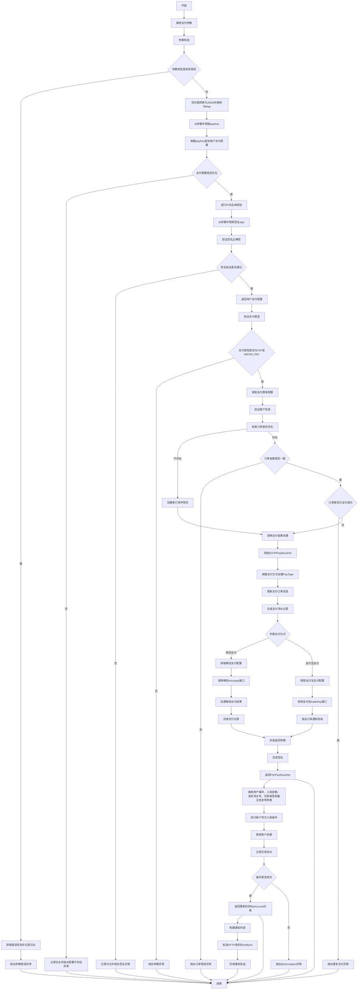

# 业务能力分析报告

## 一、业务概述
这是一个面向商户的在线支付系统，主要处理面对面支付、扫码支付等交易场景，包含账户管理、订单处理、资金结算、安全验证和异步通知等功能模块。

## 二、汇总流程图

## 三、业务规则汇总
### 3.1 参数校验规则
- 入账金额必须为正数且符合账户系统金额精度要求
- 商户编号不能为空
- 商户订单号不能为空
- 用户账户必须存在且状态正常才能执行入账操作
- 支付过程中发生业务异常时需要返回具体的错误信息给前端展示
- 系统异常时统一返回系统异常提示，不暴露具体的技术细节
- 必须通过参数校验才能继续执行
- payKey对应的商户必须存在且有效

### 3.2 安全验证规则
- 相同请求流水号不允许重复入账以防止重复操作
- 只有安全等级为MD5_IP时才进行IP验证
- 请求IP不能为空，否则抛出参数错误异常
- 请求IP必须在商户服务器IP白名单中，否则视为非法请求
- 请求参数必须包含正确的MD5签名验证
- 需要对参数进行签名验证以确保数据安全性

### 3.3 交易处理规则
- 入账操作需要同时更新账户余额和交易流水记录保证数据一致性
- 仅支持面对面支付(F2F_PAY)和刷卡支付(MICRO_PAY)两种交易类型
- 必须验证商户支付配置的有效性
- 订单号对应的订单如果不存在则需要创建新的支付订单
- 已存在的订单金额必须与请求中的订单价格一致
- 已支付成功的订单不允许重复支付
- 需要根据支付产品和支付方式获取相应的费率配置
- 支持微信刷卡支付和支付宝当面付两种支付方式
- 需要验证商户支付配置信息是否完整
- 微信支付需要进行验签处理，失败时标记订单为失败状态
- 支付结果未知时需要启动轮询机制确认最终结果
- 返回结果需要使用商户密钥进行签名验证
- 支付记录和支付订单的状态都需要更新为SUCCESS
- 当资金流入类型为平台收款时需要进行账户入账操作
- 不同支付类型都需向商户发送支付成功通知
- 整个方法需要在事务中执行，发生异常时回滚
- 用户支付配置不能为空，否则抛出异常
- 必须包含支付KEY、商品名称、订单编号、订单金额等核心参数
- 日期时间需要按照特定格式进行格式化
- 支付记录和订单必须同时更新为失败状态
- 需要保存银行返回的具体失败原因信息
- 失败后必须向商户发送通知
- 订单状态初始化为等待支付(WAITING_PAYMENT)
- 订单过期时间设置为当前时间
- 订单有效期设置为0（可能表示使用系统默认有效期）
- 需要正确解析yyyyMMdd和yyyyMMddHHmmss格式的时间字符串
- 交易状态初始设置为等待支付(WAITING_PAYMENT)
- 交易类型固定设置为支出(EXPENSE)，订单来源设置为用户支出(USER_EXPENSE)
- 当资金流向为平台收款(PLAT_RECEIVES)时，需要根据费率计算平台收入、成本和利润
- 平台收入=订单金额*费率/100，平台成本=订单金额*微信费率/100，平台利润=平台收入-平台成本
- 支付流水号和银行订单号通过构建服务自动生成
- 交易流水号必须保证全局唯一性
- 交易流水号应具有一定的可读性和格式规范
- 银行订单号必须保证全局唯一性
- 订单号格式需符合银行系统的规范要求
- 每次调用应生成不同的订单号
- 只查询状态为激活(Active)的支付方式
- 通过三个维度编码组合唯一确定一个支付方式
- 必须同时提供支付产品编码、支付方式编码和支付类型编码
- 只查询状态为激活(PublicStatusEnum.ACTIVE)的用户信息
- 使用userNo字段匹配传入的merchantNo参数进行查询

### 3.4 其他规则
- 必须先设置JMS模板的默认目标队列为订单通知队列
- 消息内容必须为订单号字符串格式
- 使用JMS的MessageCreator模式创建消息
- 必须提供有效的通知URL地址
- 通知发送失败时需要进行重试机制
- 必须提供有效的银行订单号才能执行通知发送
- 通知发送过程中需要确保消息的可靠性和完整性
- 商户编号不能为空
- 商户订单号不能为空
- 必须存在对应的交易支付订单记录
- 必须确保商户编号和订单号的组合能够唯一确定一个支付订单
- 需要验证用户支付配置的有效性
- 必须确保支付请求参数的完整性和正确性
- 需要记录支付交易日志便于后续对账

## 四、关联实体列表
| 实体 | 类型 | 含义 |
|------|------|------|
| RpAccount | Entity | 用户账户实体，包含账户余额和账户信息 |
| RpTradePaymentOrder | Entity | 交易支付订单实体，包含订单的详细支付信息 |
| RpUserPayConfig | Entity | 用户支付配置信息，包含用户的支付渠道配置和商户信息 |
| F2FPayRequestBo | Business Object | 面对面支付请求业务对象，包含支付金额、商品信息、订单号等支付请求参数 |
| F2FPayResultVo | Value Object | 面对面支付结果值对象，包含支付状态、交易流水号、支付结果等信息 |
| RpPayWay | Entity | 支付方式配置信息，包含支付通道编码、名称、支付类型等 |
| RpTradePaymentRecord | Entity | 交易支付记录实体，包含交易相关信息 |
| RpUserInfo | Entity | 用户信息实体，包含商户的详细信息 |
| RpUserPayInfo | Entity | 用户支付信息实体 |

## 五、输入输出语义
### 输入
系统接收多种类型的输入参数：用户账户操作相关的用户编号、金额、请求流水号；支付订单相关的商户编号、订单号、金额、支付方式；安全验证相关的支付密钥、IP地址、签名信息；以及各种业务配置和请求参数等。

### 输出
系统返回多种类型的输出结果：账户操作返回更新后的账户信息；支付处理返回支付结果值对象；查询操作返回对应的实体信息；通知操作无返回值但会异步发送消息；异常情况会抛出相应的业务异常。